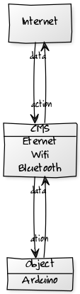

name: inverse
layout: true
class: center, middle, inverse

---

name: one-title
layout: true
class: center, middle

---

template: inverse
# 사물과 인터넷 I
### Sharp 2Y0A21을 이용한 재실시스템 

---

template: one-title

# 잇점연구소 소개

---

layout: false
# 준비물

* 노트북
* 아두니오
* 거리센서 (Sharp 2Y0A21)

---

# 아두이노


---

# 아두이노IDE 설치 

http://arduino.cc/en/Main/Software

---

# Sharp 2Y0A21


---

# 특징 

.left-column[
  ## 저렴
]
.right-column[
  ## $14

  https://www.sparkfun.com/products/242
]

---

# 특징 

.left-column[
  ## 저렴
  ## IR 방식
]
.right-column[
  
]

---

# 특징 

.left-column[
  ## 저렴
  ## IR 방식
  ## 아날로그 출력
]
.right-column[
  
]

---

# 특징 

* 저렴
* IR 방식
* 절대거리 (10~80cm)
* 아날로그 출력
* 정확한 거리는 아님

---

# 작동개요


* GND : Ground
* Vcc : IC power-supply pin
* Vo : Volt Output

---

# 작동개요


출처 - http://robobob.co.kr/22

---

# 샘플코드 작성

```cpp
int sensorPin = A0;
int sensorValue = 0; 

void setup() {
  Serial.begin(9600);
}

void loop() {
 sensorValue = analogRead(sensorPin);  
 Serial.println(sensorValue);
 delay(300);
}
```

[sketch.ino](data/sketch/sketch.ino)

---

# 라이브러리

[라이브러리 다운로드](https://github.com/jeroendoggen/arduino-distance-sensor-library)

라이브러리 사용 시연

---

template: inverse
# 각자 테스트 및 휴식

### 체크포인트 
* 스케치를 아두이노에 올릴 수 있나요?
* GND, Vcc, Vo 를 구분 할 수 있나요?

---

layout: false
# 인터넷



[gimmick:yuml]( [CMS|Eternet;Wifi;Bluetooth]-ation >[Object|Arduino], [Object|Arduino]-data>[CMS|Eternet;Wifi;Bluetooth], [CMS|Eternet;Wifi;Bluetooth]-data>[Internet], [Internet]-action>[CMS|Eternet;Wifi;Bluetooth] )

---

# How?

사물을 어떻게 인터넷과 연결 할 것인가?

* 아두이노에서 작접 연결 
  * [Arduino Yum](http://arduino.cc/en/Main/ArduinoBoardYun) - Eternet, WiFi
  * [Blueinno](http://www.icbanq.com/shop/product_detail.asp?prod_code=P005638665&catg_code=) - Bluetooth
* PC를 통해서 연결 
  * 시리얼 통신

---

# Where?

데이터를 어디로 보낼 것인가?

* 자체CMS
* SNS (Tweet, Facebook)
* Messenger (Telegram, KakaoTalk)

---

# 시리얼 통신

* 네이티브 시리얼 소켓 프로그램
* Adobe AIR
* node.js

---

# node.js


Node.js® is a platform built on Chrome's JavaScript runtime for easily building fast, scalable network applications. Node.js uses an event-driven, non-blocking I/O model that makes it lightweight and efficient, perfect for data-intensive real-time applications that run across distributed devices.

---

# node.js

* 서버사이드를 위한 자바스크립트.
* 구글이 만들어서 겁나 빠르고 좋음.

[node.js 설치](http://nodejs.org/download/)

[serial port](https://github.com/voodootikigod/node-serialport)

---

# 샘플코드 작성

```javascript
var message;
var http = require('http');
http.createServer(function (req, res) {
  res.writeHead(200, {'Content-Type': 'text/plain'});
  res.end(message+'\n');
}).listen(1337, '127.0.0.1');
//console.log('Server running at http://127.0.0.1:1337/');

var SerialPort = require("serialport")
var serialport = new SerialPort.SerialPort("/dev/tty.usbmodem411", {
  baudrate: 9600,
  parser: SerialPort.parsers.readline("\n")
});
serialport.open(function (error) {
  if ( error ) {
    //console.log('failed to open: '+error);
  } else {
    //console.log('open');
    serialport.on('data', function(data) {
      //console.log('data received: ' + data);
      message = data;
    });
  }
});
```

[serial.js](data/serial.js)

---

# 다른 예제

[깃헙 링크](https://github.com/dustMason/arduino-sharp-2y0a21)

---

template: inverse
# 정리

### 체크포인트 

* 시리얼을 통해 값을 받을 수 있나요?
* 외부(브라우저 등)에서 값을 확인 할 수 있나요?

---

template: inverse
## 끝 


