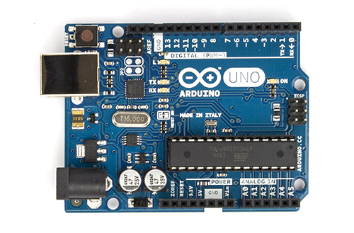
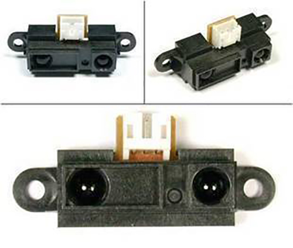
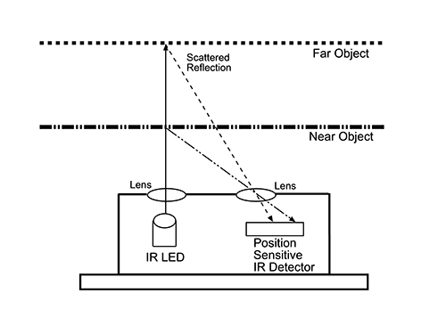
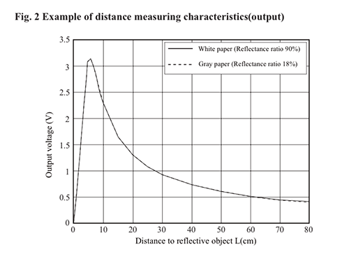
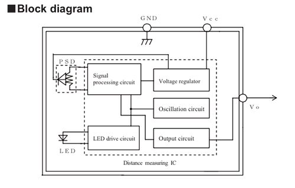
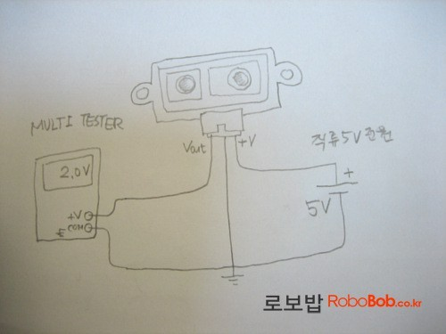

# 사물과 인터넷 I

## 간단한 잇점연구소 소개

## 준비물

* 노트북
* 아두니오
* 거리센서 (Sharp 2Y0A21)

## 아두이노

## 아두이노IDE 설치 

http://arduino.cc/en/Main/Software

## Sharp 2Y0A21

## 특징 

* 저렴
* IR 방식
* 절대거리 (10~80cm)
* 아날로그 출력
* 정확한 거리는 아님

### 저렴

$14
https://www.sparkfun.com/products/242

### IR 방식

### 아날로그 출력

## 작동개요

## RAW 데이터 확인하기

[깃헙 링크](http://example.net/)

## 라이브러리

[깃헙 링크](https://github.com/dustMason/arduino-sharp-2y0a21)

라이브러리 사용 시연

## 각자 테스트

### 체크포인트 
* 스케치를 아두이노에 올릴 수 있나요?
* GND, Vcc, Vo 를 구분 할 수 있나요?

## 5분간 휴식

## 인터넷

[gimmick:yuml]( [CMS|Eternet;Wifi;Bluetooth]-ation >[Object|Arduino], [Object|Arduino]-data>[CMS|Eternet;Wifi;Bluetooth], [CMS|Eternet;Wifi;Bluetooth]-data>[Internet], [Internet]-action>[CMS|Eternet;Wifi;Bluetooth] )

## How?

사물을 어떻게 인터넷과 연결 할 것인가?

* 아두이노에서 작접 연결 
  * [Arduino Yum](http://arduino.cc/en/Main/ArduinoBoardYun) - Eternet, WiFi
  * [Blueinno](http://www.icbanq.com/shop/product_detail.asp?prod_code=P005638665&catg_code=) - Bluetooth
* PC를 통해서 연결 
  * 시리얼 통신

## Where?

데이터를 어디로 보낼 것인가?

* 자체CMS
* SNS (Tweet, Facebook)
* Messenger (Telegram, KakaoTalk)

## 시리얼 통신

* 네이티브 시리얼 소켓 프로그램
* Adobe AIR
* node.js

## node.js

Node.js® is a platform built on Chrome's JavaScript runtime for easily building fast, scalable network applications. Node.js uses an event-driven, non-blocking I/O model that makes it lightweight and efficient, perfect for data-intensive real-time applications that run across distributed devices.
[node.js 설치](http://nodejs.org/download/)

## 샘플 node.js 작성

[serial port](https://github.com/voodootikigod/node-serialport)
[깃헙 링크](http://example.net/)

## 정리

