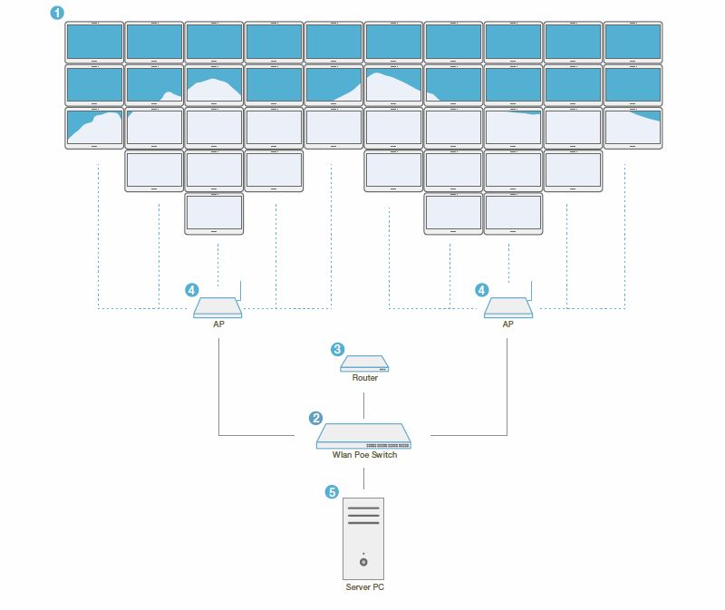
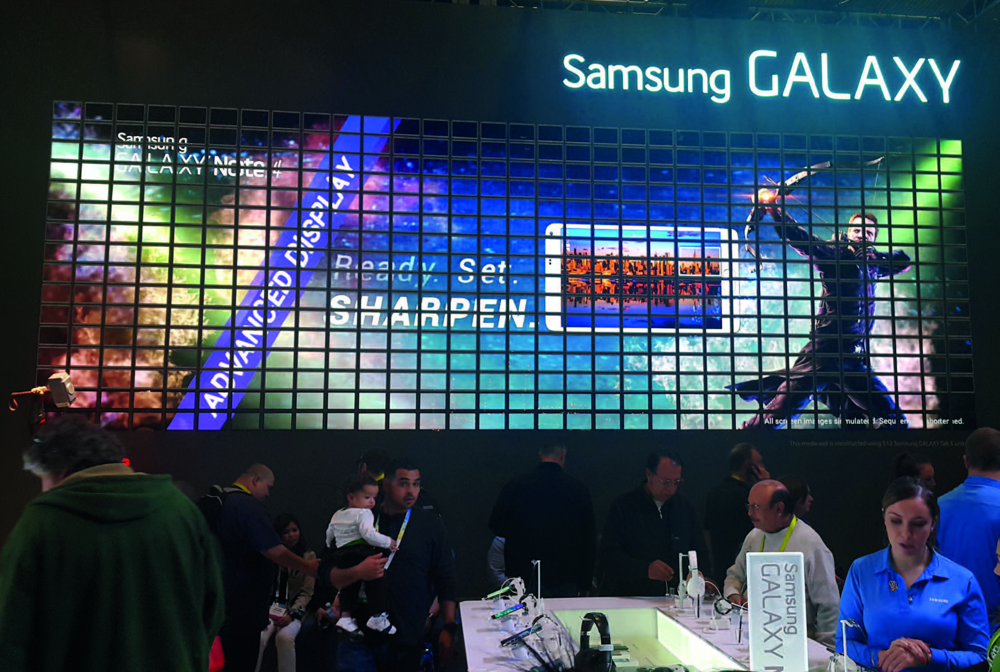
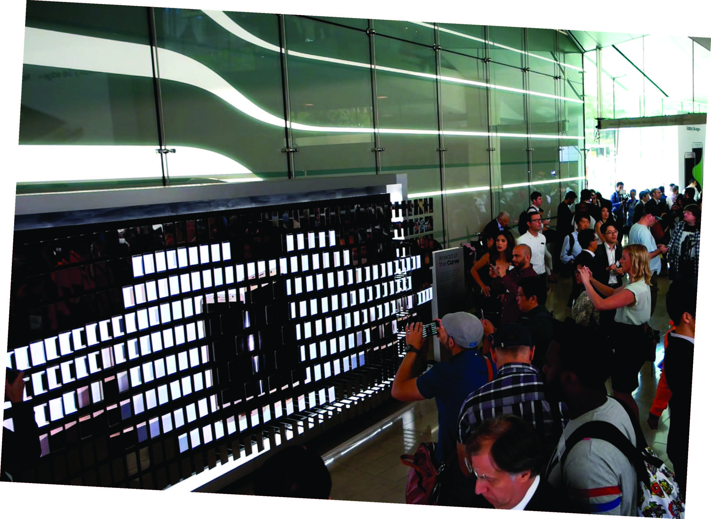

name: inverse
layout: true
class: center, middle, inverse

---

name: one-title
layout: true
class: center, middle

---

template: inverse
# WAVENET
### 음파를 이용한 네트워킹 

---

template: one-title
# 출발
### 멀티 디바이스 월

---

layout: false

# WiFi

---

# WiFi

---

# USB

---

# USB

---

template: inverse

# 다른 대안은?

---

template: one-title

# 다른 대안은?
## LAN

---

template: one-title

# 다른 대안은?
## LAN
## Audio

---

template: one-title

# 문제는 비용과 설치의 어려움!
# WiFi 이외의 무선 통신은 불가능한가?

---

# 가청 주파수 대역 조절을 통한 네트워킹

---

# 아이러니

## 네트워크의 독립성을 목표로 하였으나 결국 네트워크가 필요함

---

template: inverse

# 진행상황

---

layout: false

# 플랫폼 1

## Puredata + MobMuPlat

---

# 플랫폼 2

## Browser + Javascript

[http://sewonist.github.io/SoundNetwork/m3/](http://sewonist.github.io/SoundNetwork/m3/)

test platform : 
- PC : Chrome
- iOS : [Bowser](https://itunes.apple.com/us/app/bowser/id560478358?mt=8)
- Android : [Chrome (up to 46)](https://play.google.com/store/apps/details?id=com.android.chrome&hl=en)

---

template: inverse

# 응용사례

---

# 음파공간

---

# 구조 요청 장치

---

# 광고 추적

> “사용자가 웹에서 실버푸시 광고주를 만나게 되면, 이 광고주는 컴퓨터에 쿠키를 넣고, 동시에 컴퓨터나 디바이스에 연결된 스피커로 초음파 오디오를 재생시킨다. 사람의 귀에 들리지 않는 이 코드는 해당 SDK가 설치된 다른 스마트 디바이스가 인식할 수 있다. 실버푸시는 또한 오디오 비콘 신호를 TV 광고에도 심는데, 이 신호는 특정 앱이 설치된 디바이스에 ‘조용히’ 인식된다. 이 오디오 비콘은 실버푸시 같은 회사들이 어떤 광고를 사용자들이 보는지, 채널을 바꿀 때까지 얼마나 오래 보는지, 어떤 종류의 스마트 디바이스를 이용하는지를 파악하게 한다.”

